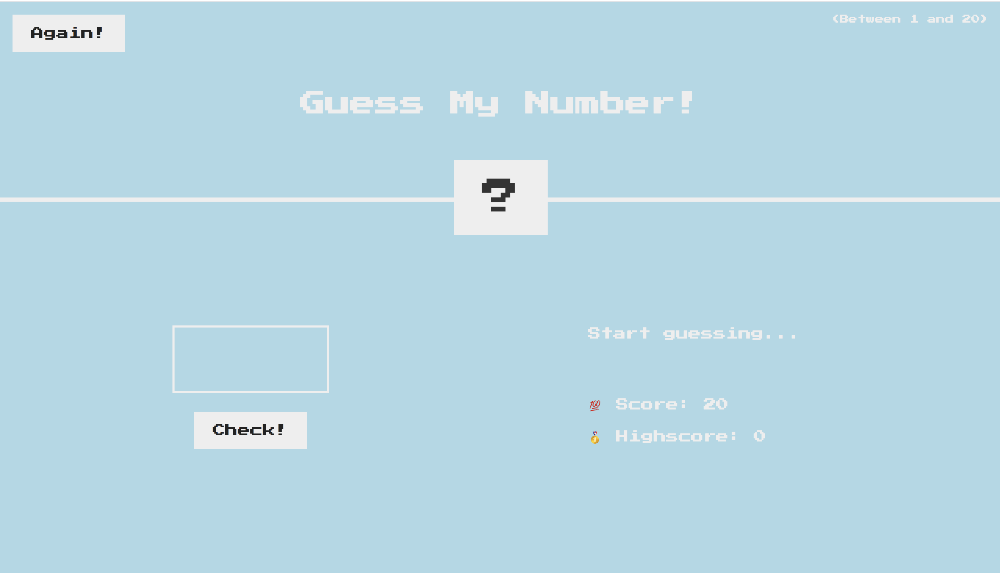
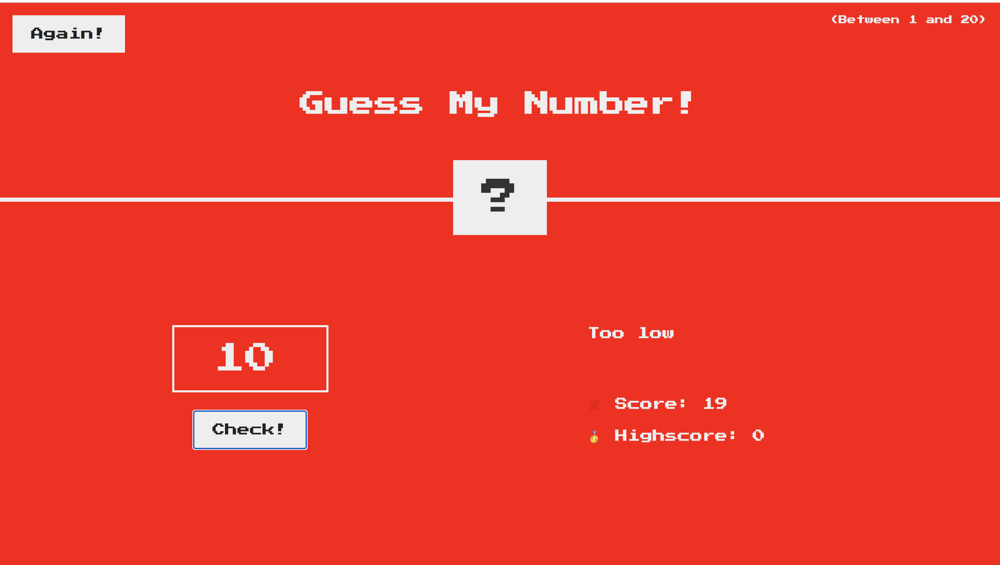
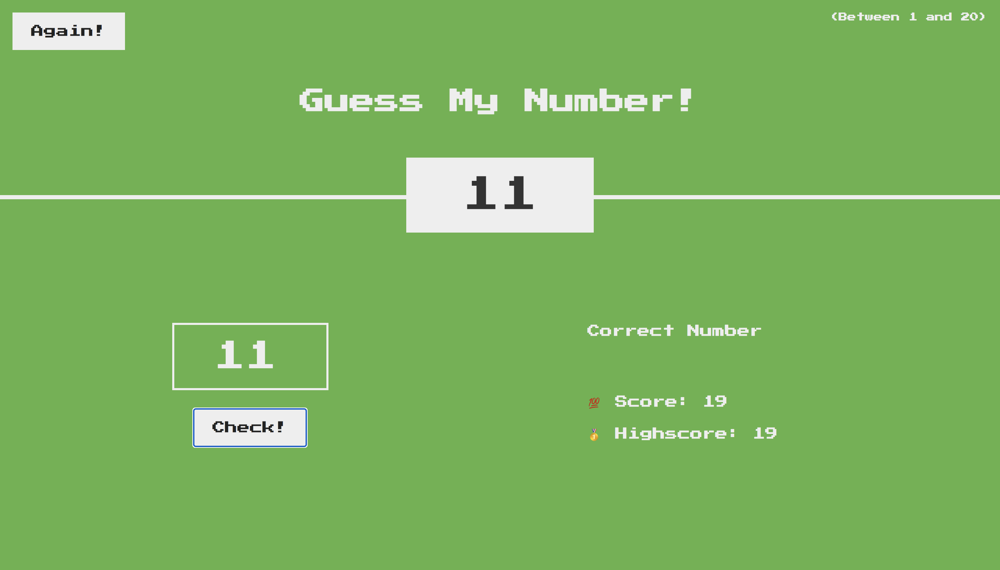

# guess-the-number

## Description:

This is a a guess-my-number game that uses HTML, CSS, and Javascript. Everytime a player loads the page, they have the option to play the game. It includes a play again button and tracks the highscore. 

-- The DOM Manipulation was used in this project. 

## Visuals: 

